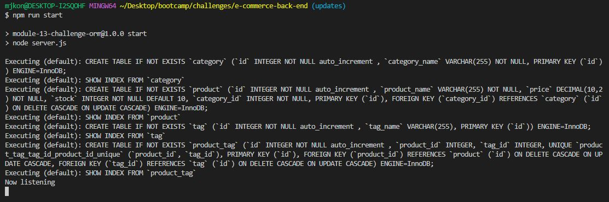
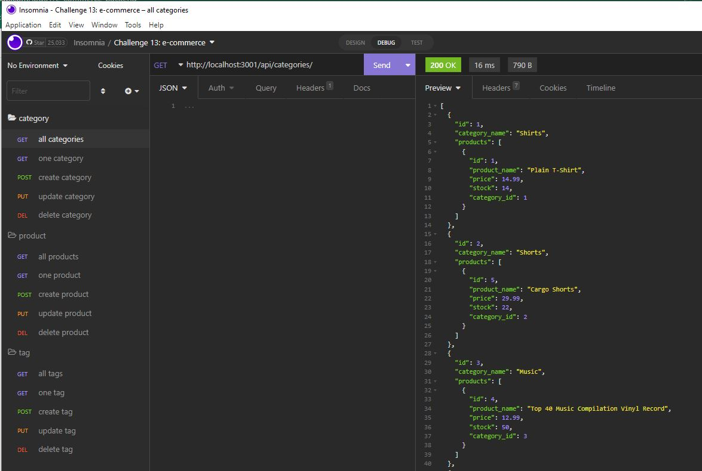

# E-Commerce Back End

## Description

This application is the back end for an E-Commerce website and was built using MySQL2, Express.js, Sequelize, and dotenv. The project uses different database models and routes so the user can perform simple CRUD commands to create, view, update, and delete information from the database. The motivation for this project was to get experience creating and using a RESTful application. 

## Video Link
[Link to app demonstration](https://app.castify.com/watch/d3a2828c-970c-4f0c-8312-22bce2ba4215)

## Installation

The necessary dependencies can be installed by running `npm i` in the command line.

## Usage

Create a .env file using the example to securely store your credentials so the app has access to them 
To start using the app, enter the command `mysql -u root -p` in the command line and then enter your password 
Enter `source db/schema.sql` to create the databse and then enter `quit` to stop using mysql 
To seed and start the app enter `npm run seed` followed by `npm run start` 

>After entering `npm run start` the app is now ready to use 
>

>Because this repo only contains code for the back end, the routes can be used in Insomnia. Below is an example of the GET route to view all product categories in Insomnia. 
>

## License
MIT license. Please refer to the license in the repo